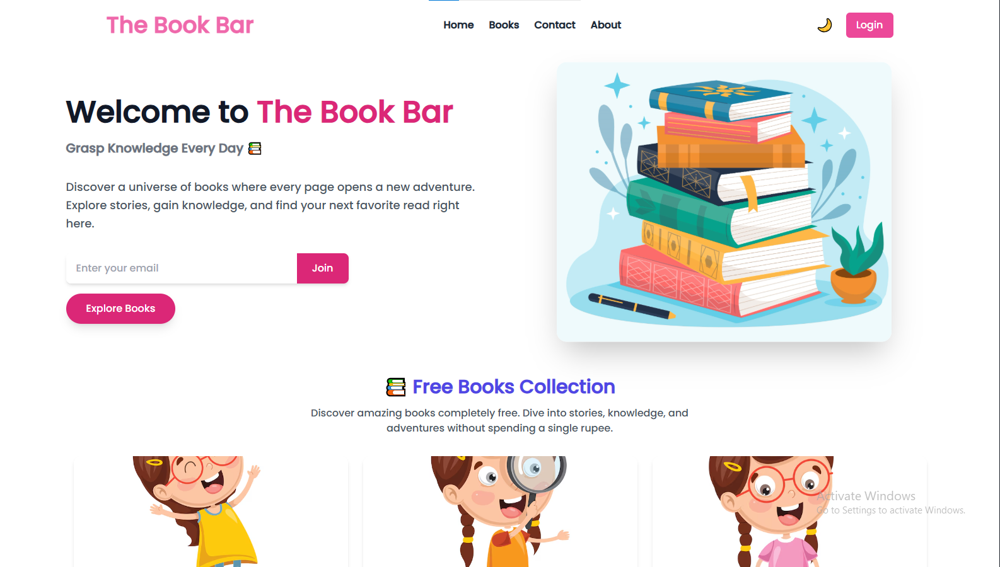
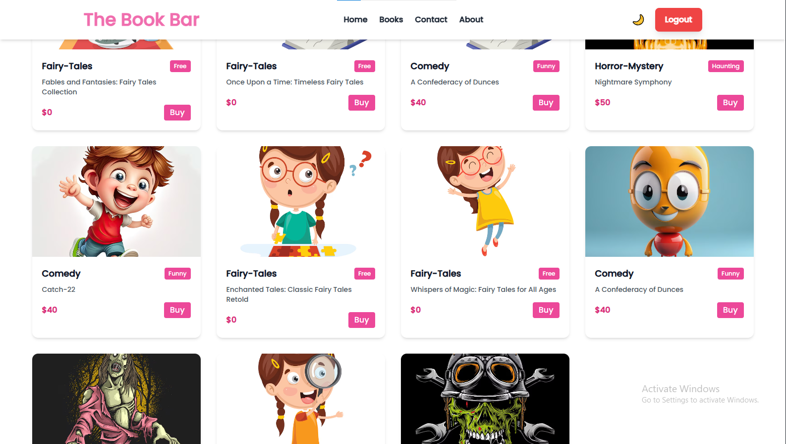

## 🌐 Live Website  (wait for a minute to load)

👉 [Visit Live Website](https://the-book-bar-ydxw.onrender.com/)

# 📚 The Book Bar

A modern **Book Store Web Application** where users can explore books after logging in.
Built using **React, Node.js, Express, and MongoDB** with a clean responsive UI.

---

## 🚀 Features

* 🔐 User Authentication (Signup & Login)
* 📖 Browse Books (Login required)
* 🎨 Responsive UI with Tailwind CSS
* 🌙 Dark / Light Mode
* 📱 Mobile Friendly Design
* 🔒 Protected Routes
* ⚡ Fast React SPA

---

## 🛠️ Tech Stack

**Frontend**

* React
* React Router
* Tailwind CSS
* Framer Motion
* React Hook Form
* React Hot Toast

**Backend**

* Node.js
* Express.js
* MongoDB
* Mongoose

---

## 📂 Project Structure

```
BookStore
│
├── frontend
│   ├── components
│   ├── context
│   ├── home
│   ├── courses
│   └── App.jsx
│
├── backend
│   ├── controllers
│   ├── models
│   ├── routes
│   └── server.js
```

---

## ⚙️ Installation

Clone the repository:

```bash
git clone Im-Rahul-Panchal/The-Book-bar.git
```

Go to project directory:


Install dependencies:

```bash
npm install
```

Run the project:

```bash
npm run dev
```

---

## 🔑 Environment Variables

Create a `.env` file in the backend folder:

```
PORT=4000
MONGO_URI=your_mongodb_connection
```

---

## 📸 Screenshots

Homepage view:



Books Page:



---

## 🤝 Contributing

Pull requests are welcome. For major changes, please open an issue first to discuss what you would like to change.

---

## 📜 License

This project is not licensed.

---

## 👨‍💻 Author

Developed by **Rahul Panchal**

